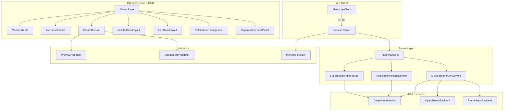
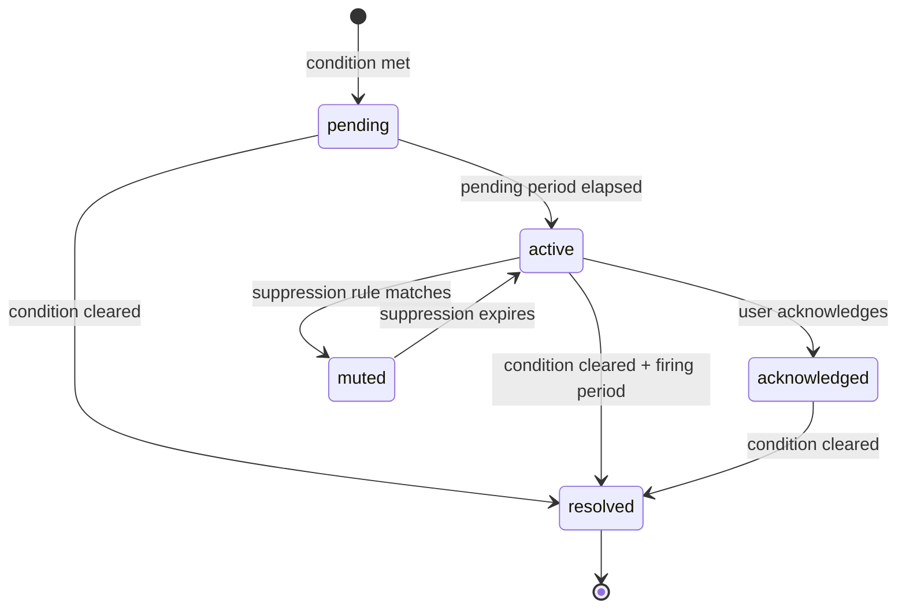

# Design Document: Prometheus Alerting

## Overview

This design extends the existing Alert Manager standalone application to complete the Prometheus alerting workflow end-to-end. The current codebase has a solid foundation: multi-backend architecture (`MultiBackendAlertService`), unified types (`UnifiedRule`, `UnifiedAlert`), progressive loading with per-datasource status, a PromQL editor with syntax highlighting and autocomplete, and a rich UI built on OUI components. However, the system currently runs entirely on mock data.

This design focuses on:
1. Making monitor CRUD fully functional with proper validation and persistence
2. Completing the alert management workflow (filtering, acknowledgment, silencing)
3. Adding notification routing and suppression rule management
4. Implementing monitor configuration serialization (JSON export/import)
5. Ensuring the PromQL editor validation is robust and testable

The architecture preserves the existing patterns: backend abstraction via `OpenSearchBackend`/`PrometheusBackend` interfaces, unified types for the UI, progressive loading with `ProgressiveResponse`, and the Express server with REST API routes.

## Architecture



The key architectural additions are:
- `NotificationRoutingService` and `SuppressionRuleService` as new core services
- `MonitorFormValidator` for comprehensive form validation
- `MonitorSerializer` for JSON export/import with round-trip guarantees
- New API routes for routing rules, suppression rules, and monitor import

## Components and Interfaces

### MonitorFormValidator

Validates monitor creation/edit forms before submission. Extracted as a pure function for testability.

```typescript
interface MonitorFormState {
  name: string;
  query: string;
  threshold: ThresholdCondition;
  evaluationInterval: string;
  pendingPeriod: string;
  firingPeriod: string;
  labels: LabelEntry[];
  annotations: AnnotationEntry[];
  severity: UnifiedAlertSeverity;
  enabled: boolean;
}

interface ValidationResult {
  valid: boolean;
  errors: ValidationError[];
}

interface ValidationError {
  field: string;
  message: string;
}

function validateMonitorForm(form: MonitorFormState): ValidationResult;
```

Validation rules:
- `name`: non-empty, max 256 chars, no control characters
- `query`: non-empty, passes PromQL syntax validation
- `threshold.value`: finite number
- `evaluationInterval`, `pendingPeriod`, `firingPeriod`: valid duration strings (e.g. "1m", "5m", "1h"), positive values
- `labels`: keys are non-empty, no duplicate keys
- `annotations`: keys are non-empty

### PromQL Validator

Extends the existing `validatePromQL` function with structured error reporting.

```typescript
interface PromQLValidationResult {
  valid: boolean;
  errors: PromQLError[];
  warnings: PromQLWarning[];
}

interface PromQLError {
  position: number;
  message: string;
  type: 'bracket_mismatch' | 'invalid_function' | 'invalid_duration' | 'syntax_error';
}

interface PromQLWarning {
  position: number;
  message: string;
  type: 'high_cardinality' | 'missing_rate' | 'performance';
}

function validatePromQL(query: string): PromQLValidationResult;
```

### MonitorSerializer

Handles JSON serialization/deserialization of monitor configurations with validation.

```typescript
interface MonitorConfig {
  name: string;
  query: string;
  threshold: ThresholdCondition;
  evaluationInterval: string;
  pendingPeriod: string;
  firingPeriod: string;
  labels: Record<string, string>;
  annotations: Record<string, string>;
  severity: UnifiedAlertSeverity;
  routing?: NotificationRouting[];
}

function serializeMonitor(rule: UnifiedRule): MonitorConfig;
function deserializeMonitor(json: unknown): { config: MonitorConfig | null; errors: string[] };
function serializeMonitors(rules: UnifiedRule[]): MonitorConfig[];
```

### NotificationRoutingService

Manages routing rules that determine where alerts are sent.

```typescript
interface RoutingRule {
  id: string;
  name: string;
  matchLabels: Record<string, string>;
  matchSeverity?: UnifiedAlertSeverity[];
  timeWindow?: { hours: string; days: string };
  destinations: RoutingDestination[];
  groupBy?: string[];
  groupWindow?: string;
  groupLimit?: number;
  closeWindow?: string;
  priority: number;
  enabled: boolean;
}

interface RoutingDestination {
  type: 'slack' | 'pagerduty' | 'sns' | 'webhook' | 'email';
  target: string;
  templateId?: string;
}

interface NotificationRoutingService {
  list(): Promise<RoutingRule[]>;
  get(id: string): Promise<RoutingRule | null>;
  create(input: Omit<RoutingRule, 'id'>): Promise<RoutingRule>;
  update(id: string, input: Partial<RoutingRule>): Promise<RoutingRule | null>;
  delete(id: string): Promise<boolean>;
  findMatchingRules(alert: UnifiedAlert): RoutingRule[];
}
```

### SuppressionRuleService

Manages suppression rules for muting alerts.

```typescript
interface SuppressionRuleConfig {
  id: string;
  name: string;
  description: string;
  matchLabels: Record<string, string>;
  schedule: SuppressionSchedule;
  status: 'active' | 'scheduled' | 'expired' | 'disabled';
  createdBy: string;
  createdAt: string;
  expiresAt?: string;
}

interface SuppressionSchedule {
  type: 'one_time' | 'recurring';
  startTime: string;
  endTime: string;
  recurrence?: { days: string[]; timezone: string };
}

interface SuppressionRuleService {
  list(): Promise<SuppressionRuleConfig[]>;
  get(id: string): Promise<SuppressionRuleConfig | null>;
  create(input: Omit<SuppressionRuleConfig, 'id' | 'status'>): Promise<SuppressionRuleConfig>;
  update(id: string, input: Partial<SuppressionRuleConfig>): Promise<SuppressionRuleConfig | null>;
  delete(id: string): Promise<boolean>;
  isAlertSuppressed(alert: UnifiedAlert): boolean;
  getActiveRules(): Promise<SuppressionRuleConfig[]>;
}
```

### API Routes (additions to Express server)

```
POST   /api/monitors                    - Create monitor
PUT    /api/monitors/:id                - Update monitor
DELETE /api/monitors/:id                - Delete monitor
POST   /api/monitors/import             - Import monitors from JSON
GET    /api/monitors/export             - Export monitors as JSON

GET    /api/routing-rules               - List routing rules
POST   /api/routing-rules               - Create routing rule
PUT    /api/routing-rules/:id           - Update routing rule
DELETE /api/routing-rules/:id           - Delete routing rule

GET    /api/suppression-rules           - List suppression rules
POST   /api/suppression-rules           - Create suppression rule
PUT    /api/suppression-rules/:id       - Update suppression rule
DELETE /api/suppression-rules/:id       - Delete suppression rule

POST   /api/alerts/:id/acknowledge      - Acknowledge alert
POST   /api/alerts/:id/silence          - Silence alert
```

## Data Models

### Monitor Configuration (for serialization)

```typescript
interface MonitorConfig {
  version: '1.0';
  name: string;
  description?: string;
  query: string;
  threshold: {
    operator: '>' | '>=' | '<' | '<=' | '==' | '!=';
    value: number;
    unit?: string;
    forDuration: string;
  };
  evaluation: {
    interval: string;
    pendingPeriod: string;
    firingPeriod: string;
  };
  labels: Record<string, string>;
  annotations: Record<string, string>;
  severity: UnifiedAlertSeverity;
  routing?: Array<{
    channel: string;
    destination: string;
    severity?: UnifiedAlertSeverity[];
    throttle?: string;
  }>;
}
```

### Duration String Format

Durations follow the pattern `<number><unit>` where unit is one of: `s` (seconds), `m` (minutes), `h` (hours), `d` (days). Examples: `30s`, `5m`, `1h`, `7d`.

```typescript
function parseDuration(input: string): { valid: boolean; seconds: number; error?: string };
function formatDuration(seconds: number): string;
```

### Alert State Transitions




## Correctness Properties

*A property is a characteristic or behavior that should hold true across all valid executions of a system — essentially, a formal statement about what the system should do. Properties serve as the bridge between human-readable specifications and machine-verifiable correctness guarantees.*

The following properties are derived from the acceptance criteria in the requirements document. Each property is universally quantified and designed for property-based testing.

### Property 1: Monitor creation round-trip

*For any* valid monitor form (with non-empty name, valid PromQL query, valid threshold, valid durations, arbitrary labels, and arbitrary annotations), creating the monitor and then retrieving it should yield a configuration equivalent to the original form data — name, query, threshold, evaluation settings, labels, and annotations should all match.

**Validates: Requirements 1.1, 1.3, 1.5, 1.6**

### Property 2: Monitor form validation rejects invalid inputs

*For any* monitor form where the name is empty or consists only of whitespace, or the query is empty, the validator should return `valid: false` with at least one error referencing the invalid field. The set of errors should be non-empty and each error should identify the specific field that failed validation.

**Validates: Requirements 1.7**

### Property 3: Duration string validation

*For any* string, the duration parser should accept it if and only if it matches the pattern `<positive-integer><unit>` where unit is one of `s`, `m`, `h`, `d`. For all accepted durations, the parsed seconds value should be positive. For all rejected strings, an error message should be returned.

**Validates: Requirements 1.4**

### Property 4: PromQL bracket validation

*For any* string containing mismatched parentheses, square brackets, or curly braces, the PromQL validator should return `valid: false` with at least one error of type `bracket_mismatch`. Conversely, for any string where all bracket types are properly matched, the validator should not report bracket mismatch errors.

**Validates: Requirements 1.2, 4.2**

### Property 5: Monitor text search filtering

*For any* list of monitors and any non-empty search query string, every monitor in the filtered result should contain the query string (case-insensitive) in at least one of: its name, any label value, or any annotation value. No monitor matching the query should be excluded from the results.

**Validates: Requirements 2.2**

### Property 6: Monitor faceted filtering

*For any* list of monitors and any combination of active filters (status, severity, monitor type, health status, backend), every monitor in the filtered result should match ALL active filter criteria simultaneously. The result should contain exactly the monitors that satisfy every filter.

**Validates: Requirements 2.3**

### Property 7: Monitor sorting

*For any* list of monitors and any sortable column (name, severity, status, lastTriggered), sorting in ascending order should produce a list where each element is less than or equal to the next element according to that column's comparison function. Sorting in descending order should produce the reverse.

**Validates: Requirements 2.4**

### Property 8: Bulk delete removes all selected monitors

*For any* list of monitors and any subset selected for deletion, after bulk delete, the remaining list should contain none of the selected monitors and all of the unselected monitors.

**Validates: Requirements 2.5**

### Property 9: Alert faceted filtering

*For any* list of alerts and any combination of active filters (severity, state, labels), every alert in the filtered result should match ALL active filter criteria. The result should contain exactly the alerts that satisfy every filter.

**Validates: Requirements 3.2**

### Property 10: Alert acknowledgment state transition

*For any* alert in the `active` state, acknowledging it should change its state to `acknowledged` and set a non-null acknowledgment timestamp. The alert should remain in the alerts list (not removed).

**Validates: Requirements 3.4**

### Property 11: PromQL autocomplete relevance

*For any* partial input string in the PromQL editor, every autocomplete suggestion should be a valid PromQL function name, known metric name, known label name, or known label value that contains the input as a substring (case-insensitive).

**Validates: Requirements 4.1**

### Property 12: PromQL prettify idempotence

*For any* valid PromQL query string, applying the prettify function twice should produce the same result as applying it once. That is, `prettify(prettify(q)) === prettify(q)`.

**Validates: Requirements 4.4**

### Property 13: Routing rule matching

*For any* alert and any ordered list of routing rules, the matching function should return exactly those rules where: (a) all label matchers match the alert's labels, (b) severity filter includes the alert's severity (or is unset), and (c) time window includes the current time (or is unset). If no specific rules match and a default rule exists, the default rule should be returned.

**Validates: Requirements 6.1, 6.2, 6.4**

### Property 14: Alert grouping by labels

*For any* set of alerts and any grouping configuration (group_by labels), alerts that share the same values for all group_by labels should be placed in the same group. Alerts with different values for any group_by label should be in different groups. The total number of alerts across all groups should equal the input count.

**Validates: Requirements 6.3**

### Property 15: Suppression rule matching

*For any* alert and any set of active suppression rules, the `isAlertSuppressed` function should return `true` if and only if there exists at least one active rule whose label matchers all match the alert's labels and whose schedule includes the current time.

**Validates: Requirements 7.1, 7.2**

### Property 16: Suppression expiry restores state

*For any* suppression rule that is currently active, disabling or expiring the rule should cause `isAlertSuppressed` to return `false` for alerts that were previously suppressed only by that rule (and no other active rule).

**Validates: Requirements 7.3**

### Property 17: Suppression conflict detection

*For any* two suppression rules with overlapping label matchers (where one rule's matchers are a subset of the other's) and overlapping time schedules, the conflict detector should identify them as conflicting. Rules with non-overlapping schedules or disjoint label matchers should not be flagged as conflicting.

**Validates: Requirements 7.5**

### Property 18: Progressive loading includes all datasource results

*For any* set of datasources where all fetches succeed, the unified response should contain results from every datasource, and the total result count should equal the sum of per-datasource result counts.

**Validates: Requirements 8.1**

### Property 19: Timeout handling preserves partial results

*For any* set of datasources where some succeed and some time out, the response should contain all results from successful datasources, zero results from timed-out datasources, and the datasource status should correctly reflect `success` or `timeout` for each.

**Validates: Requirements 8.2**

### Property 20: Cache serves data within TTL

*For any* cached response stored at time T, a request at time T + delta (where delta < 30 seconds) should return the cached data. A request at time T + delta (where delta >= 30 seconds) should trigger a fresh fetch.

**Validates: Requirements 8.4**

### Property 21: Monitor serialization round-trip

*For any* valid monitor configuration, serializing it to JSON and then deserializing the JSON should produce a configuration equivalent to the original. Specifically, `deserialize(serialize(config))` should equal `config` for all fields.

**Validates: Requirements 9.1, 9.2, 9.3, 9.4**

### Property 22: Invalid config import returns descriptive errors

*For any* JSON object that is missing required fields (name, query, threshold, evaluation) or has fields with invalid types, the deserializer should return `null` for the config and a non-empty errors array where each error identifies the specific invalid field.

**Validates: Requirements 9.5**

## Error Handling

### Validation Errors
- Monitor form validation returns structured `ValidationError[]` with field names and messages
- PromQL validation returns `PromQLError[]` with position, message, and error type
- Duration parsing returns descriptive error messages for invalid formats
- Monitor import returns field-level errors for invalid JSON structures

### Backend Errors
- Per-datasource timeout (default 10s) with `Promise.allSettled()` — no single datasource failure blocks others
- Timed-out datasources marked with `timeout` status in `ProgressiveResponse`
- Failed datasources marked with `error` status and error message preserved
- Auto-retry with exponential backoff (existing: max 3 attempts, 2s-8s delays)

### Notification Errors
- Failed notification deliveries logged with destination, error, and timestamp
- Retry logic for transient failures (network timeouts, rate limits)
- Fallback channel support when primary destination fails

### State Errors
- Invalid state transitions (e.g., acknowledging a resolved alert) return descriptive errors
- Concurrent modification conflicts handled with optimistic locking where applicable

## Testing Strategy

### Testing Framework

- Unit tests and property-based tests: [fast-check](https://github.com/dubzzz/fast-check) for TypeScript
- Test runner: Jest (or Vitest if preferred)
- Both unit tests and property tests are complementary and required

### Unit Tests

Unit tests cover specific examples, edge cases, and integration points:
- Specific valid/invalid monitor form examples
- Edge cases for duration parsing (zero, negative, overflow, empty string)
- PromQL validation with known valid/invalid queries
- Specific routing rule matching scenarios
- Suppression rule schedule boundary conditions

### Property-Based Tests

Each correctness property maps to a property-based test with minimum 100 iterations. Tests use `fast-check` arbitraries to generate random inputs.

Key generators needed:
- `arbitraryMonitorForm()`: generates valid `MonitorFormState` with random names, queries, thresholds, durations, labels, annotations
- `arbitraryPromQLQuery()`: generates syntactically varied PromQL strings (valid and invalid)
- `arbitraryDurationString()`: generates duration strings (valid and invalid formats)
- `arbitraryUnifiedRule()`: generates `UnifiedRule` objects with random field values
- `arbitraryUnifiedAlert()`: generates `UnifiedAlert` objects with random states, severities, labels
- `arbitraryRoutingRule()`: generates `RoutingRule` objects with random match conditions
- `arbitrarySuppressionRule()`: generates `SuppressionRuleConfig` objects with random schedules and matchers
- `arbitraryMonitorConfig()`: generates valid `MonitorConfig` objects for serialization testing

Each property test must be tagged with: **Feature: prometheus-alerting, Property {number}: {property_text}**

### Test Organization

Tests are co-located with source files:
- `core/validators.test.ts` — monitor form validation, duration parsing
- `core/promql_validator.test.ts` — PromQL validation, bracket matching
- `core/filter.test.ts` — monitor and alert filtering, sorting
- `core/routing.test.ts` — notification routing rule matching, alert grouping
- `core/suppression.test.ts` — suppression rule matching, conflict detection
- `core/serializer.test.ts` — monitor serialization round-trip, import validation
- `core/alert_service.test.ts` — progressive loading, timeout handling, caching
